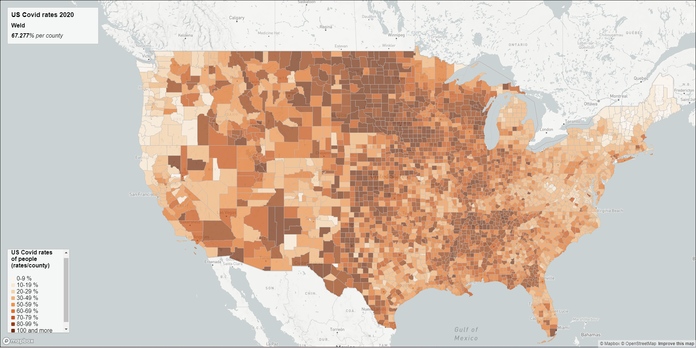
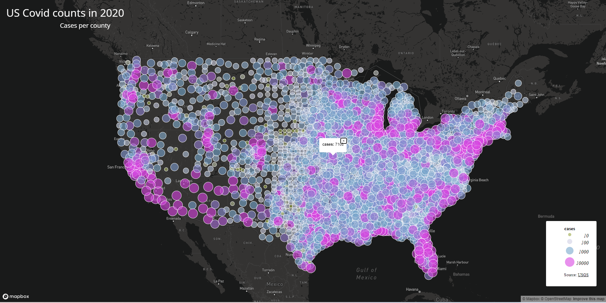

# Web Map Application
These two are thematic maps of COVID-19 in 2020. Map 1 is indicating the US Covid rates in 2020 with layer by rates per county. The Map 2 indicating the US Covid counts in 2020 with different number of cases within a county.

# US Covid rates map in 2020 - Map 1

[Here](https://github.com/Gunehee/geog458_Lab3_WebMap/blob/main/map1.html) is a url for the map 1 (Rates map) html code

# US Covid counts map in 2020 - Map 2

[Here](https://github.com/Gunehee/geog458_Lab3_WebMap/blob/main/map2.html) is a url for the map 2 (Counts map) html code

